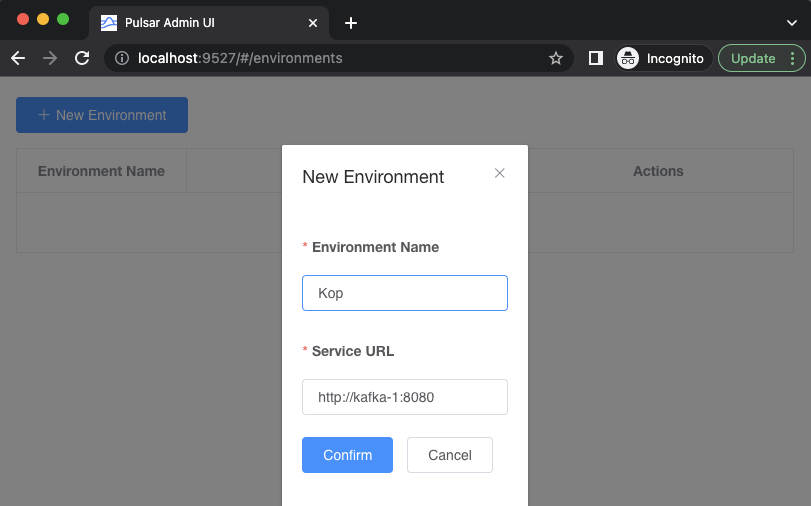

# Error Handling Patterns in Pulsar

Requirements
------------

- [Docker](https://www.docker.com/get-started) 4.11+
- [Java](https://openjdk.org/install/) 17+
- [Maven](https://maven.apache.org/download.cgi) 3.8.6+
- [Apache Pulsar](https://pulsar.apache.org/download) 2.10.1+

Ensure you have allocated enough memory to Docker: at least 8Gb.

On Macs with ARM chip, enabling Rosetta for amd64 emulation on Docker will make your containers boot faster.

🏢 Shared Apache Pulsar Infrastructure
--------------------------------------
Before jumping into any of the scenarios, you must start the infrastructure all of them will use. 

1️⃣ Start Pulsar


```bash
sh start-broker.sh
```

👀 You must wait until the container `pulsar` is healthy to proceed with the next step.


2️⃣ Start monitoring (Optional)
```bash
sh start-monitoring.sh
```

This command with start two new containers `monitoring-grafana-1` and `monitoring-prometheus-1`. To verify that prometheus 
has started successfully, you can access to http://localhost:9090/targets, to ensure that prometheus is detecting all 
pulsar components. 

To access the Grafana Dashboard at http://localhost:3000. The default user name is `admin`, the default password 
is `happypulsaring`


3️⃣ Start the control plane (Optional)

```bash
sh start-control-plane.sh
```

👀 You must wait until the container `pulsar-manager` is healthy before you can access the UI and create an environment. Once the container is running, you should see a screen similar to the following when you visit [http://localhost:9527](http://localhost:9527). Enter `admin` for the username and `apachepulsar` as the password.


Next, you will need to add an environment to the Pulsar Manager. An environment represents a Pulsar instance or a group of clusters you want to manage. A Pulsar Manager is capable of managing multiple environments.

Click "New Environment" button to add an environment.
Input the "Environment Name". The environment name is used for identifying an environment.
Input the "Service URL". The Service URL is the admin service url of your Pulsar cluster.
You need to make sure that Pulsar Manager is able to access the service url. In this example, both the pulsar container and pulsar-manager container use the same docker network. So you can use pulsar container name as the domain name of the pulsar standalone cluster. Thus, you can type http://pulsar:8080 in the service URL box and click on the `confirm` button.



This will create the environment and allow you to manage the Pulsar cluster from the Pulsar Manager UI.


✅ Pattern 1: Stop on Error
-------------------------------------------------------


✅ Pattern 2: Retry out of order, a.k.a. Negative Ack
-------------------------------------------------------


References
- https://github.com/streamnative/apache-pulsar-grafana-dashboard